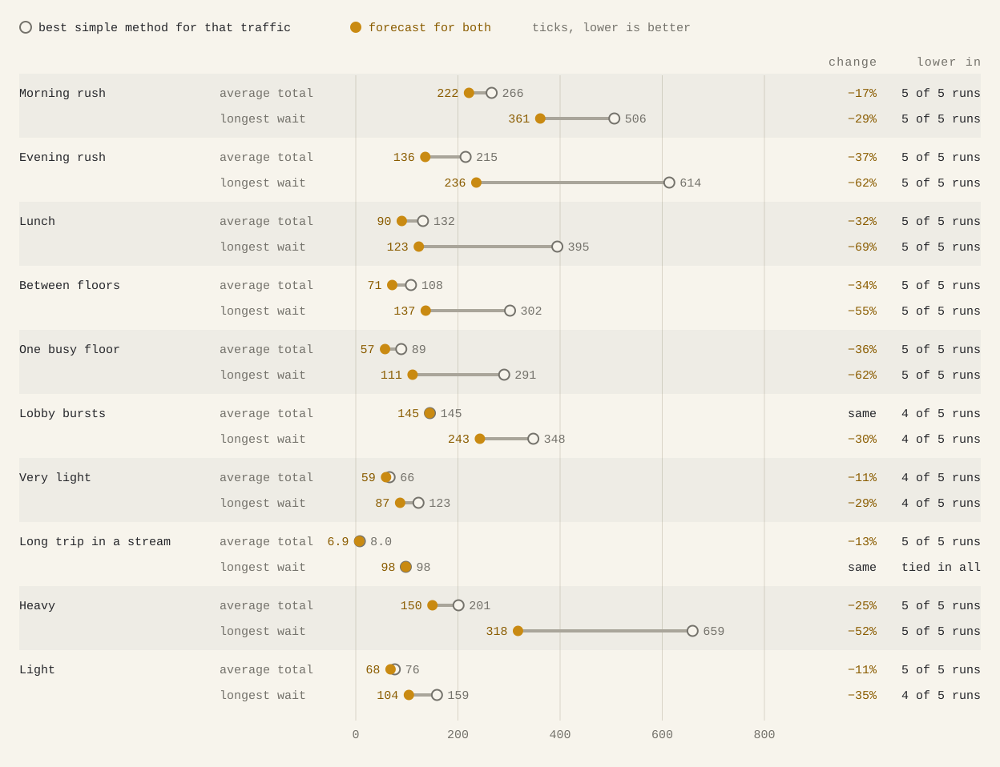
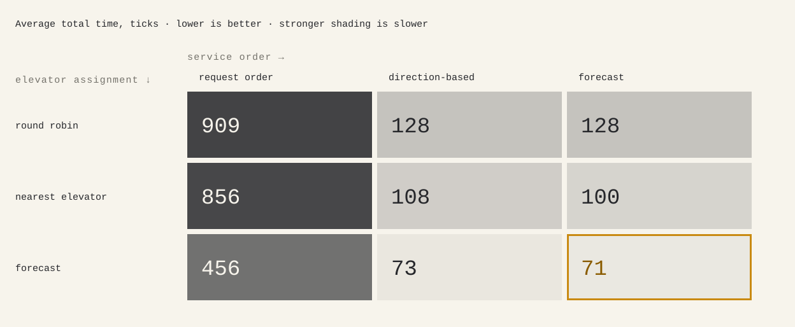
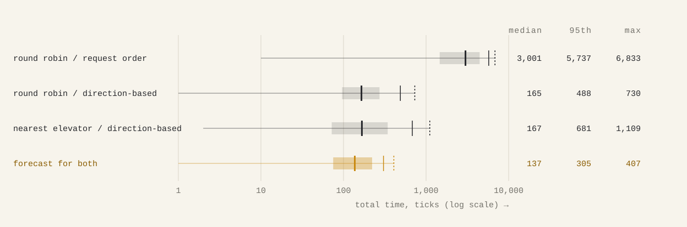
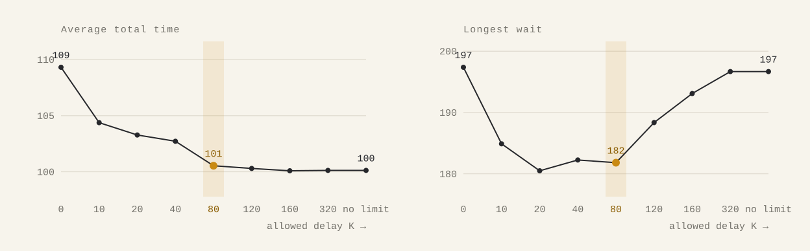

# Elevator simulation

A discrete-time simulation of a destination-dispatch elevator system. Each passenger gives their origin and destination when they call, the system assigns them an elevator straight away, and time moves one floor of travel per tick.

This simulation splits the scheduler into two decisions:

- **Elevator assignment:** which elevator takes a new passenger. Made once, when the request arrives, and never changed.
- **Service order:** which waiting passenger an elevator picks up next. Drop-offs are not a choice: riders get off at their floor.

Both decisions change how long people wait:

- **Elevator assignment:** a passenger calls from floor 30. Elevator A is idle at floor 1, elevator B at floor 25. A reaches them in 29 ticks, B in 5.
- **Service order:** an elevator at floor 1 has two passengers waiting, at floor 30 (going to 31) and at floor 5 (going to 10). Picking up floor 5 on the way costs the other passenger nothing. Serving floor 30 first, then coming back, makes the floor 5 passenger wait 56 ticks instead of 4.

Each decision has three methods, chosen before a run. The default is **forecast** for both: across 10 traffic types it has the lowest or tied average total time, and it cuts the longest wait by about 30 to 70%.

## How to run

Python 3.10 or later, standard library only.

```
python3 main.py requests.csv
python3 main.py requests.csv --elevators 2 --assignment nearest --service-order direction
python3 main.py requests.csv --allowed-delay 20
python3 -m unittest
```

| Option | Default | Meaning |
| --- | --- | --- |
| `--floors` | 100 | floors are numbered 1 to n |
| `--elevators` | 4 | all start at floor 1 |
| `--capacity` | 10 | passengers per elevator |
| `--assignment` | `forecast` | `round-robin`, `nearest` or `forecast` |
| `--service-order` | `forecast` | `request`, `direction` or `forecast` |
| `--allowed-delay` | 80 | forecast service order only: the fairness limit K in ticks, or `none` |
| `--positions-out` | `positions.csv` | the position log |

The input CSV has the columns `time,id,source,dest`. The position log has one row per tick from 0: `time,elevator_0,elevator_1,...`.

**Example output.** The statistics the assignment asks for, printed by the first command on its sample input (`requests.csv`, three passengers):

```
Building: 100 floors, 4 elevators, capacity 10, assignment forecast, service order forecast
Allowed delay: 80
Passengers: 3   Last tick: 50
Wait time    min     0   median     0.0   average     6.33   95th percentile    19   max    19
Travel time  min    19   median    36.0   average    35.00   95th percentile    50   max    50
Total time   min    36   median    38.0   average    41.33   95th percentile    50   max    50
Longest wait: passenger3 (20 to 1) waited 19 ticks for elevator 2
Elevator 0: 1 passenger, moved 50 floors
Elevator 1: 1 passenger, moved 36 floors
Elevator 2: 1 passenger, moved 38 floors
Elevator 3: 0 passengers, moved 0 floors
Position log written to positions.csv
```

From Python, the same run is one call on a list of requests:

```python
from simulation import simulate

positions, passengers = simulate(
    [(0, 'passenger1', 1, 51), (0, 'passenger2', 1, 37), (10, 'passenger3', 20, 1)],
)
```

## How a tick works

1. **Drop off** riders whose destination is the elevator's floor.
2. **Release** the requests made at this tick, in file order, and assign each to an elevator. Later requests are not looked at.
3. **Pick up** waiting passengers at each elevator's floor, as the service order and capacity allow.
4. **Log** every elevator's floor.
5. **Stop** once every request has been made and every passenger delivered.
6. **Move** each elevator one floor toward its service order's target.

Wait time is pickup minus request, travel time is drop-off minus pickup, and total time is wait plus travel.

## The methods

### Elevator assignment

**Round robin:** elevators take turns.
- Good: simplest; spreads people evenly, so a lobby burst never piles into one elevator.
- Bad: ignores where elevators are and how full they are, so it can send a passenger to a busy elevator far away while another sits idle on their floor.

**Nearest elevator:** the elevator that can reach the passenger soonest, counting the detour if they are not on its way.
- Good: cheap; uses where each elevator already has to go.
- Bad: counts floors, not how busy or full an elevator is, so a lobby rush can pile onto the one elevator already there.

**Forecast assignment:** for each elevator, forecast everyone's drop-off times with and without the new passenger, using the same service order the elevators follow. Choose the elevator whose combined total time rises least.
- Good: sees waiting passengers, capacity and detours. Lowest or tied average on every traffic type. Its forecasts match what then happens, because they run the same code.
- Bad: the slowest method, and it plans only for passengers already waiting, so a choice that is best now can leave no elevator free for the next request.

### Service order

**Request order:** first come, first served.
- Good: nobody can be passed over.
- Bad: it only picks up the next passenger in line, so when several are waiting on different floors, it carries them one at a time and passes the others.

**Direction-based:** keep going one way, pick up anyone on the way going that way who fits, and turn only when empty with nothing ahead.
- Good: efficient; free pickups on the way.
- Bad: no memory of who asked first; a passenger can be passed again and again while the elevator arrives full.

**Forecast service order:** each elevator keeps a pickup order. A new passenger is tried at every position, and the order with the lowest combined total time is kept, as long as nobody already assigned arrives more than **K** ticks after their first forecast.
- Good: one dial between fairness and efficiency, and K is a guarantee.
- Bad: slower, and it follows its pickup order strictly, so it passes a passenger later in the order even when it has room.

## Results

Forecast for both against the best simple method for each traffic type: the best of round robin or nearest elevator with request order or direction-based, picked by average. Default building (100 floors, 4 elevators, capacity 10), synthetic seeded traffic, mean of 5 runs, times in ticks.

<picture>
  <source media="(prefers-color-scheme: dark)" srcset="images/forecast-vs-best-simple-dark.svg">
  
</picture>

- **Forecast has the best average on every traffic type**, tying only on lobby bursts, and cuts the longest wait by roughly 30 to 70% everywhere except the long trip in a stream.

Every pair of methods, random trips between floors (mean of 5 runs):

<picture>
  <source media="(prefers-color-scheme: dark)" srcset="images/nine-combinations-dark.svg">
  
</picture>

- **Elevator assignment is the bigger lever.** With direction-based service, switching the assignment from round robin to forecast cuts trips between random floors from 128 to 73; switching the service order to forecast then gives 71.
- **Forecast's service order earns its place on the worst case.** With forecast assignment, it cuts the longest wait from 467 to 318 in heavy traffic and from 490 to 236 in the evening rush.
- **Request order collapses under load:** an elevator carries about one rider per trip (heavy traffic: 2,984 with round robin / request order, against 150 with forecast for both).

Spread across passengers in heavy traffic:

<picture>
  <source media="(prefers-color-scheme: dark)" srcset="images/time-spread-dark.svg">
  
</picture>

Heavy random traffic, every passenger from 5 runs. The band covers the middle half of passengers; the marks are the median, 95th percentile and maximum.

`python3 experiments/compare.py` (about 2 minutes) reproduces these averages and longest waits, for this building and a 30-floor one, in [`experiments/results.md`](experiments/results.md).

## Fairness: choosing K

<picture>
  <source media="(prefers-color-scheme: dark)" srcset="images/allowed-delay-dark.svg">
  
</picture>

**Choosing K.** Forecast for both, over 10 traffic types and 5 runs each. The average improves as K grows and flattens at about K = 80, within 1% of no limit (101 against 100). The longest wait is near its lowest there (182, against 181 at K = 20) and rises after it, to 197 with no limit. So K = 80 is the default. It was tuned on this building and these traffic types; for another building or load, the same sweep would find the K that best balances fairness and efficiency there.

**Can anyone wait forever?**

- **Request order:** no.
- **Direction-based:** with an endless stream that keeps the elevator full, yes. With a finite input everyone is still served.
- **Forecast:** no, while K is set.

The assignment decides how crowded your elevator gets; only the service order decides whether others can keep going first. Overload is different: if requests arrive faster than the elevators can carry them, everyone waits longer, whatever the methods.

## Bonus

- **Different algorithms:** three for each decision (round robin, nearest elevator, forecast; request order, direction-based, forecast), compared in Results.
- **Fairness vs efficiency:** the allowed delay K. See "Fairness: choosing K".
- **Zones and express elevators:** not built. See "What I would improve with more time".

## How I know it's correct

- **70 unit tests** with exact times and positions worked out by hand, including the assignment's sample input.
- **The code refuses to break a rule:** an elevator will not board someone at another floor, over capacity or going the wrong way, or reverse with riders aboard.
- **An outside rule check** (`python3 experiments/check.py`). It covers 270 runs: every traffic type, every method pair and 3 buildings. It reads only the position log and each passenger's times, and checks floors, one floor per tick, pickups and drop-offs where the elevator was, capacity and direction. It was tested by corrupting runs on purpose. Separate runs with their own traffic also found nothing broken, and every forecast matched what happened; that data is in [`experiments/data/`](experiments/data/).
- **No peeking:** removing every request after a tick T leaves the log up to T unchanged.
- **K holds:** nobody is dropped off more than K ticks after their first forecast.

## Assumptions

- One tick is one floor, as the assignment defines it. Boarding and leaving take no time.
- One bank of elevators. Every elevator serves every floor, and every trip is one ride with no transfers (no sky lobbies).
- Floors start at 1. All elevators start at floor 1 and have the same capacity.
- An elevator never reverses with riders aboard; only passengers going the riders' way may board.
- An idle elevator stays where it is.
- Assignments and destinations never change.
- Same-tick requests are handled in file order; unsorted input is sorted by time.
- Invalid requests are rejected with a clear message: floors out of range, source equal to destination, bad or negative times, blank or repeated ids.
- There is no tick limit, so a request at a huge time means a huge position log.

## Performance

Default building, random traffic between floors, one run at a time on an Apple M4 Pro:

| Passengers | Methods | Seconds | Per passenger |
| --- | --- | ---: | ---: |
| 1,000 spread over time | forecast / forecast | 1.4 | 1.4 ms |
| 20,000 spread over time | forecast / forecast | 33 | 1.6 ms |
| 200 all at tick 0 | forecast / forecast | 3.7 | 18 ms |
| 500 all at tick 0 | forecast / forecast | 51 | 100 ms |
| 20,000 spread over time | nearest / direction-based | 0.25 | 0.01 ms |

A real building handles requests one at a time as they arrive, so the time per passenger (the run's seconds divided by its passengers) is roughly what each decision costs. Even the slowest case here is about a tenth of a second.

The cost depends on **how many passengers are waiting per elevator**, not on how many have been served. Forecast slows down only when a queue builds: everyone at tick 0, or more traffic than the elevators can carry. The timing runs, with their inputs, are in `experiments/data/`.

**Big O.** These are the costs of the code as it is today, written for clarity. Most can be lowered; see "What I would improve with more time".

- **n**: passengers one elevator holds now (aboard plus waiting); with several elevators, the busiest one
- **r**: riders aboard one elevator (at most its capacity)
- **E**: elevators
- **N**: total passengers across all elevators

One forecast plays an elevator forward stop by stop on a copy. It costs O(n²), or O(n³) at worst for direction-based, which can stop at a full elevator's waiting passengers on every sweep.

<table>
  <thead>
    <tr><th>Decision</th><th>Method</th><th>Time per new passenger</th><th>Time per tick, per elevator</th><th>Memory</th></tr>
  </thead>
  <tbody>
    <tr><td rowspan="3">Elevator assignment</td><td>Round robin</td><td>O(1)</td><td>none</td><td>O(1)</td></tr>
    <tr><td>Nearest elevator</td><td>O(E · r)</td><td>none</td><td>O(1)</td></tr>
    <tr><td>Forecast assignment</td><td>O(E · n²): 2 forecasts per elevator</td><td>none</td><td>O(n) per forecast</td></tr>
    <tr><td rowspan="3">Service order</td><td>Request order</td><td>O(1)</td><td>O(r)</td><td>O(1)</td></tr>
    <tr><td>Direction-based</td><td>O(1)</td><td>O(n)</td><td>O(E)</td></tr>
    <tr><td>Forecast service order</td><td>O(n³): n + 1 forecasts</td><td>O(r)</td><td>O(N)</td></tr>
    <tr><td>Both</td><td>Forecast for both</td><td>O(E · n³)</td><td>O(r)</td><td>O(N)</td></tr>
  </tbody>
</table>

Elevator assignment works only when a request arrives, so it costs nothing per tick.

Each passenger who boards also costs O(n) once, to remove them from the waiting list. Forecast service order keeps each passenger's first forecast until the run ends, one number per passenger.

Memory leaves out the output itself: the position log and each passenger's recorded times.

## What I would improve with more time

- **Stop time.** Stops take no time here. A stop-time setting would show whether the ranking of methods holds when stops cost something.
- **Make forecast faster without changing its results.** It is the best method and the slowest, and today it repeats work:
  - the forecast without the newcomer is usually already known, since forecasts come true until a new passenger joins;
  - with forecast for both, the chosen elevator's placement is worked out twice;
  - each position tried replays the same start of the route;
  - a position keeps being forecast after it has broken K or can no longer win.

  In prototypes with identical results, fixing the second and the last made it about 2 to 3 times faster. Going below n³ would mean trying fewer positions, which changes the results: a design choice to measure, not a free speed-up. Rewriting the forecast loop in a compiled language such as Rust would make every step faster, but would not change how the cost grows.
- **Zones and express elevators** (bonus). Both come down to the same thing here: each elevator serves only some floors, and a passenger can only go to an elevator that serves both their floors. In a morning rush, an elevator serving floors 2 to 25 turns around at 25 instead of 100, so its trips are shorter even with free stops. The cost is that it can't help anywhere else. I'd measure both sides. Real express elevators are also faster and stop less, which this model doesn't have. Later, a busy zone could borrow from a quiet one, as in Otis's SuperGroup.
- **Smarter forecast pickups.** Let passengers later in the pickup order board on the way, and let each arrival reorder those already waiting, still within K.
- **Parking idle elevators** where requests have recently come from, measuring the shorter waits against the extra empty travel.
- **Energy.** Prefer elevators already running, or add energy as a cost in the forecast.
- **Traffic that changes during the day**, such as a morning up-peak turning into an evening down-peak in one run.
- **Direction-based with the same K**, to bound its wait.
- **More measurement:** queue length and the oldest wait over time, and results by floor or direction.

## Time spent

About 1.5 to 2 days.

## Files

| File | Contents |
| --- | --- |
| `main.py` | command line: read the CSV, run, write the log, print statistics |
| `simulation.py` | `simulate()`, input checks and the tick loop |
| `assignment.py` | round robin, nearest elevator, forecast assignment |
| `service_order.py` | request order, direction-based, forecast service order, and the forecast itself |
| `elevator.py`, `passenger.py` | an elevator and a passenger |
| `test_*.py` | unit tests |
| `experiments/traffic.py` | seeded synthetic traffic, 10 types |
| `experiments/compare.py` | every method pair on every traffic type; writes `results.md` |
| `experiments/check.py` | checks every rule from the outputs alone |
| `experiments/chart_data.py` | runs the simulations behind the charts; writes `data/charts.json` |
| `experiments/data/` | raw data from the independent checks and the charts |
| `images/` | the charts in this README, light and dark |
| `requests.csv` | the assignment's example input |
